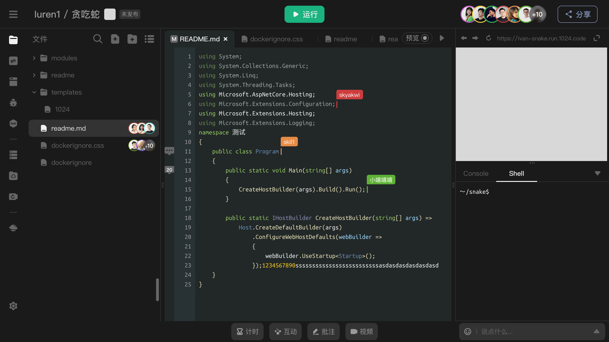

# 产品介绍

_**1024 Code**_ 是一个全新的在线编程学习、练习、协作、构建和部署环境，通过优秀的 IDE （集成开发环境）体验，让新手开发者拥有简单的互动式协作编程体验。

# IDE 界面及功能

#### 文件树

* 支持多层级的文件夹
* 协作模式下，用户停留的编辑中文件可以体现用户信息
* 支持拖拽上传，通过高亮锚点可以确定目标文件夹
* git 模式下，可以体现暂存状态下的文件

#### 代码编辑器

* 支持多文件及单文件两种模式
* md 类型文件自带预览功能
* 协作模式下，支持以不同颜色光标体现不同用户的代码操作

#### Console

显示应用启动及运行过程中的日志

#### Shell

* 以 root 权限直接控制容器，可执行几乎一切命令
* 协作模式下，用户间共享同一 session

#### 输出窗口（浏览器）

又称浏览器输出窗口

* 支持 HTTP 服务的浏览（运行端口自动识别）
* 无访问情况下持续3分14秒，容器自动关闭
* 检测到用户对网址的访问后立即启动容器及应用服务
* 协作模式下，支持浏览器窗口内容的实时同步